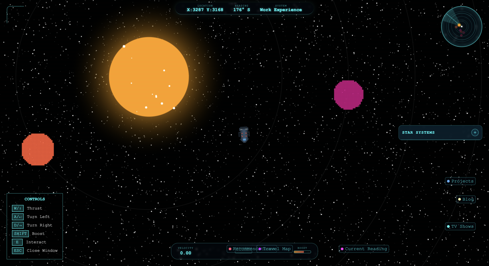

# Stellarlogs

Welcome to my interactive portfolio site! 🚀

I’m a big space nerd, inspired by creations like *The Expanse*, *For All Mankind*, *The Three-Body Problem*, and *Project Hail Mary*. Currently, I’m reading the *Bobiverse* series, where Bob, a software engineer, explores the universe as a spaceship. This sparked an idea: while I was born too early to explore the stars, I can create a universe of my own.

This portfolio is an extension of my identity. You pilot a spaceship to explore star systems, each representing a section of my life—work experience, projects, travels, and more. It’s interactive, inspired by sites like [bruno-simon.com](https://bruno-simon.com).

### Features

- Explore star systems representing different aspects of my portfolio.
- Interactive spaceship navigation.
- Plans for procedurally generated pixel graphics and on-device LLM-generated stories.
- Future addition of Cylon Raiders (from Battlestar Galactica) for some fun in-between explorations.

### Visit the Site

For the best experience, open the site on a desktop: [stellarlogs.dev](https://stellarlogs.dev)

Enjoy exploring my universe! 🌌