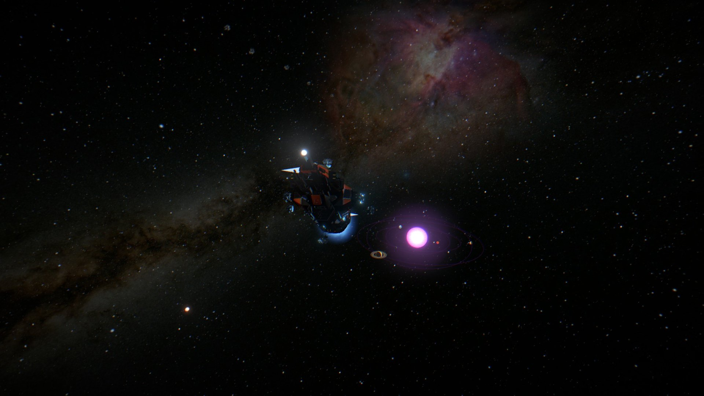
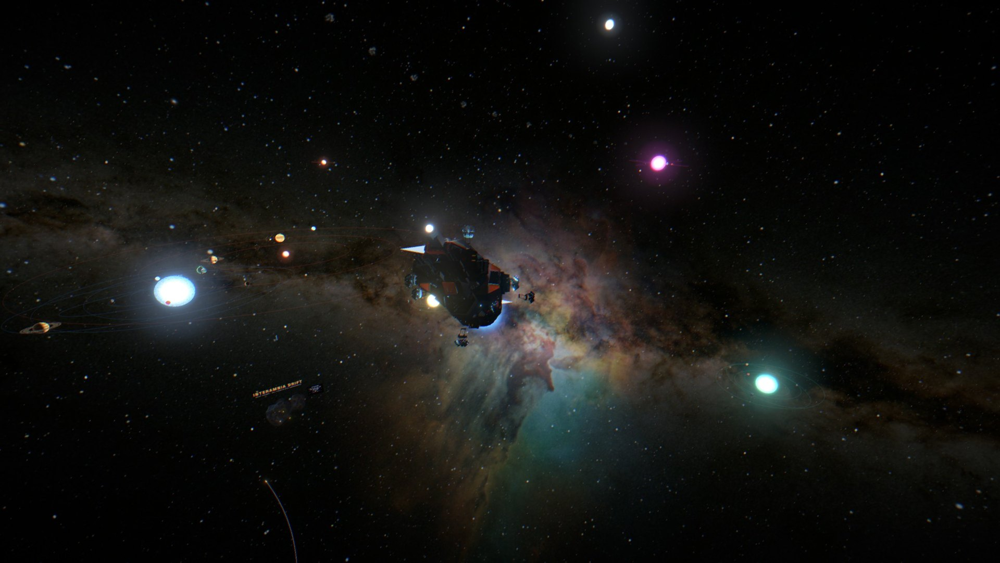

# STELLARLOGS

**A playable portfolio.** You don't scroll this résumé — you fly it.

**Fly it now → [tirthajyotighosh.com](https://tirthajyotighosh.com)** *(best on desktop; phones fly landscape)*

Inspired by *The Expanse*: a hand-built star neighborhood where every system is a
chapter of my work — experience, projects, writing, travels — and the space
between them is a living Belter colony with jobs, dangers, and memory. Newtonian
flight, flip-and-burn jumps, point-defense guns that aim themselves while you fly.

## What's out there

- **The Ice Route** — escort haulers through raider attacks; the world runs its
  jobs whether you join or not.
- **The Hunt** — chase the Draugr down her cold trail and force the surrender squawk.
- **The Khione Pass** — a charted debris storm on a real wall-clock schedule
  (every visitor on Earth shares it); stand the picket over the colony's water.
- **The Nilak Vigil** — light a candle. Every candle ever lit by any visitor burns there.
- **The Service Record** — a hand terminal in the show's own UI language, where
  port authorities countersign the deeds they witnessed.
- **The Hail Line** — leave a transmission composed from the Belter phrasebook;
  it becomes a beacon buoy other visitors fly past and read.

## Controls

| | |
|---|---|
| `W / S` | burn / retro | 
| `A / D` | yaw · `R / F` pitch · `Q / E` strafe |
| `Shift` | max burn |
| `X` | flip |
| `N` | the chart (jump between systems) |
| `L` | your service record |
| `G / H` | accept the posted job |

## Under the hood

React Three Fiber + three.js on Vercel. The bits I'm proudest of:

- **One flame for every drive** — a raymarched volumetric plume (Beer–Lambert
  absorption, shock diamonds, advected noise) shared by the player, the lane
  traffic, and the Draugr's four violet bells, with distance LOD.
- **PDC fire control** — TEWA target assignment across six ball turrets that
  physically stow at cruise and deploy for battle, servo-and-latch sound included.
- **Torpedo brain** — shared guidance classes (lead pursuit, dogleg spreads,
  terminal corkscrews, near-miss jukes) instead of per-activity scripts.
- **Procedural audio** — the drive, RCS, PDCs, klaxons: WebAudio synthesis, no samples.
- **The black box** — anonymous store-and-forward telemetry that only leaves the
  buffer once storage confirms; reads are internal-only, forever.
- **The liveness relay** — one endpoint of approved world-facts (candles,
  all-hands tallies, port pennants, hails) with clamped, rate-limited anonymous
  writes; the world stays honest when the relay is down.
- **Perf discipline** — adaptive resolution, matrix-update deadbands on ~4k
  static signage objects, probe builds for honest measurement.

## Credits

- Spaceship model: ["MCRN Tachi [Expanse TV Show]"](https://sketchfab.com/3d-models/mcrn-tachi-expanse-tv-show-76fc983ab08c449b9042491a00e621cf) by [Jakub.Vildomec](https://sketchfab.com/Jakub.Vildomec), licensed under [CC BY 4.0](https://creativecommons.org/licenses/by/4.0/).
- Space station model: ["Gateway"](https://sketchfab.com/3d-models/gateway-57c6a27313794618a299ebe9ec8c2afd) by [andreas9343](https://sketchfab.com/andreas9343), licensed under [CC BY 4.0](https://creativecommons.org/licenses/by/4.0/).
- Asteroid models: ["Asteroids Pack (metallic version)"](https://sketchfab.com/3d-models/asteroids-pack-metallic-version-eff495d9315c47dbb2777ec80bef40d8) by [SebastianSosnowski](https://sketchfab.com/SebastianSosnowski), licensed under [CC BY 4.0](https://creativecommons.org/licenses/by/4.0/).
- Nebula imagery courtesy of [ESA/Hubble](https://esahubble.org) (NASA, ESA), licensed under [CC BY 4.0](https://creativecommons.org/licenses/by/4.0/): Orion (heic0601a), Lagoon (heic1808a), Bubble (heic1608a).
- Milky Way sky: [NASA/Goddard Space Flight Center Scientific Visualization Studio, "Deep Star Maps 2020"](https://svs.gsfc.nasa.gov/4851) (public domain), tone-mapped from the source EXR.
- Torpedo model: ["Low Poly Missiles and Torpedos"](https://sketchfab.com/3d-models/low-poly-missiles-and-torpedos-99783c90ce904951a3c71e851a527d35) by [sakigakefuruzawa](https://sketchfab.com/sakigakefuruzawa), licensed under [CC BY 4.0](https://creativecommons.org/licenses/by/4.0/).
- Full asset attributions for every hull in the lanes are posted in-game at the
  Drift's **Port Registry**.
