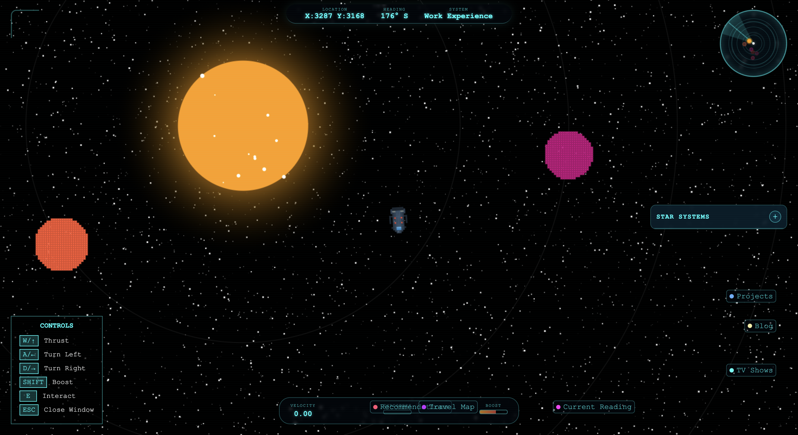

# Stellarlogs

Welcome to my interactive portfolio site! 🚀

I’m a big space nerd, inspired by creations like *The Expanse*, *For All Mankind*, *The Three-Body Problem*, and *Project Hail Mary*. Currently, I’m reading the *Bobiverse* series, where Bob, a software engineer, explores the universe as a spaceship. This sparked an idea: while I was born too early to explore the stars, I can create a universe of my own.

This portfolio is an extension of my identity. You pilot a spaceship to explore star systems, each representing a section of my life—work experience, projects, travels, and more. It’s interactive, inspired by sites like [bruno-simon.com](https://bruno-simon.com).

### Features

- Explore star systems representing different aspects of my portfolio.
- Interactive spaceship navigation.
- Plans for procedurally generated pixel graphics and on-device LLM-generated stories.
- Future addition of Cylon Raiders (from Battlestar Galactica) for some fun in-between explorations.

### Visit the Site

For the best experience, open the site on a desktop: [stellarlogs.dev](https://stellarlogs.dev)

Enjoy exploring my universe! 🌌
### Credits

- Spaceship model: ["MCRN Tachi [Expanse TV Show]"](https://sketchfab.com/3d-models/mcrn-tachi-expanse-tv-show-76fc983ab08c449b9042491a00e621cf) by [Jakub.Vildomec](https://sketchfab.com/Jakub.Vildomec), licensed under [CC BY 4.0](https://creativecommons.org/licenses/by/4.0/).
- Space station model: ["Gateway"](https://sketchfab.com/3d-models/gateway-57c6a27313794618a299ebe9ec8c2afd) by [andreas9343](https://sketchfab.com/andreas9343), licensed under [CC BY 4.0](https://creativecommons.org/licenses/by/4.0/).
- Asteroid models: ["Asteroids Pack (metallic version)"](https://sketchfab.com/3d-models/asteroids-pack-metallic-version-eff495d9315c47dbb2777ec80bef40d8) by [SebastianSosnowski](https://sketchfab.com/SebastianSosnowski), licensed under [CC BY 4.0](https://creativecommons.org/licenses/by/4.0/).
- Nebula imagery courtesy of [ESA/Hubble](https://esahubble.org) (NASA, ESA), licensed under [CC BY 4.0](https://creativecommons.org/licenses/by/4.0/): Orion (heic0601a), Lagoon (heic1808a), Bubble (heic1608a).
- Milky Way sky: [NASA/Goddard Space Flight Center Scientific Visualization Studio, "Deep Star Maps 2020"](https://svs.gsfc.nasa.gov/4851) (public domain), tone-mapped from the source EXR.
- Torpedo model: ["Low Poly Missiles and Torpedos"](https://sketchfab.com/3d-models/low-poly-missiles-and-torpedos-99783c90ce904951a3c71e851a527d35) by [sakigakefuruzawa](https://sketchfab.com/sakigakefuruzawa), licensed under [CC BY 4.0](https://creativecommons.org/licenses/by/4.0/).
- Explosion animation: ["WGStudio Explosion Animation"](https://opengameart.org/content/wgstudio-explosion-animation) by WrathGames Studio, licensed under [CC BY 3.0](https://creativecommons.org/licenses/by/3.0/).
- Cargo models (the manhunt's evidence): ["Futuristic cargo container Low-Poly"](https://sketchfab.com/3d-models/futuristic-cargo-container-low-poly-015f32ec950744c4898e17af07d43f65) by [begle](https://sketchfab.com/begle), ["Sci-fi cargo crate"](https://sketchfab.com/3d-models/sci-fi-cargo-crate-ac36898521304e51a8e305aa602f1f5b) by [andreas9343](https://sketchfab.com/andreas9343), ["Cargo Crate"](https://sketchfab.com/3d-models/cargo-crate-19a32159a3d6443e95105f4f7cb51c39) by [boysichterman](https://sketchfab.com/boysichterman), and ["Sci-Fi crate / ammunition box (2)"](https://sketchfab.com/3d-models/sci-fi-crate-ammunition-box-2-342efe4d70f94d37a4edd66a15c39502) by [ul1tka](https://sketchfab.com/ul1tka), all licensed under [CC BY 4.0](https://creativecommons.org/licenses/by/4.0/).
