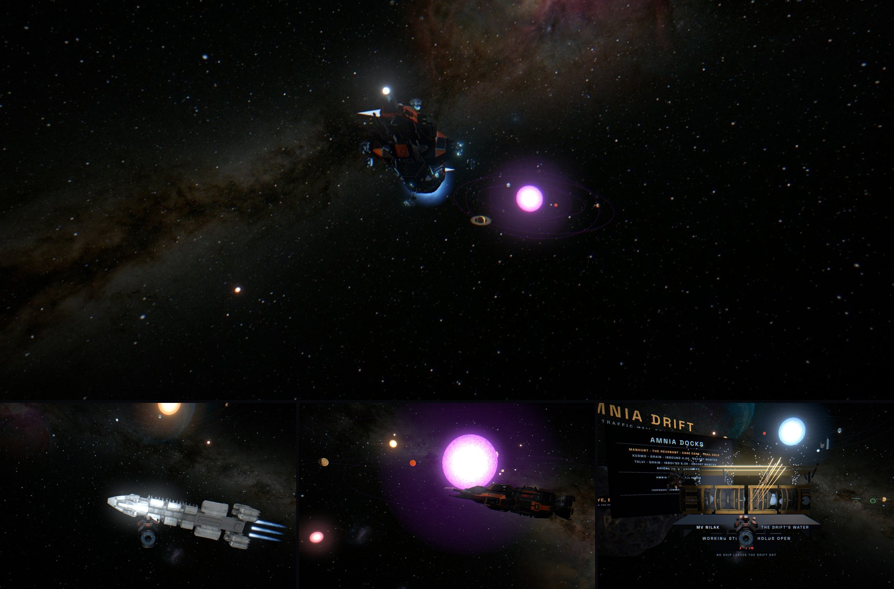

# STELLARLOGS

*a playable portfolio*

There is a rock out here. It does not look important.

A long while from now, people went to space and did what people always do: they
went to work. The great powers kept the good planets and the sunlight. Everyone
else went farther out, to the rocks — and stayed. Out here, water is rent, air
is wages, and a sound ship matters more than a good name. The people of the
rocks call themselves Belters. They are practical, unsentimental, and more
loyal than they will ever admit to being.

These systems were charted a lifetime ago by a single surveyor working alone,
and everything that moves out here still runs on his charts. At the center of
them, a colony holds to its drifting rock by ice and stubbornness. It has known
loss. You will find that it remembers, in its own way.

You're new. That's fine — everyone here was, once. Nobody will ask your name;
by Belter custom, you are what you do. Your ship obeys real physics, same as
you, only with a bigger engine: cut the drive and you coast forever; to slow
down, turn around and burn. You learn fast out here. Everyone does.

There is a berth at the docks with no name on it. It doesn't look important
either.

It's yours.

---

**From the author:** I built this universe as my portfolio. The star systems
hold my work — the projects, the experience, the places I've been — each one
somewhere you can fly. Visit them, or ignore them and just live in the Belt
for a while. Both are the point.

**→ [tirthajyotighosh.com](https://tirthajyotighosh.com)** · phones fly
landscape · the ship will teach you the rest

<b>For the engineers — mild spoilers</b>

 

Built with React Three Fiber / three.js on Vercel. The parts I'm proudest of:

- **One flame for every drive** — a raymarched volumetric exhaust plume
  (Beer–Lambert absorption, shock diamonds, advected noise) shared by the
  player's ship and every NPC hull, with distance LOD.
- **Point-defense fire control** — TEWA-style target assignment across six
  ball turrets that physically stow at cruise and deploy for battle.
- **Shared torpedo guidance** — one brain with behavior classes (lead pursuit,
  dogleg spreads, terminal corkscrews, near-miss jukes) instead of per-mission
  scripts.
- **Procedural audio** — drive, thrusters, guns, klaxons: pure WebAudio
  synthesis, zero samples.
- **Honest telemetry** — anonymous store-and-forward black box that only
  clears its buffer when storage confirms; reads are internal-only, forever.
- **A tiny multiplayer-feeling backend** — one endpoint of allowlisted
  world-facts with clamped, rate-limited anonymous writes; the world degrades
  honestly when it's down.
- **Perf discipline** — adaptive resolution, matrix-update deadbands across
  ~4k static objects, dedicated probe builds for real measurement.

## Credits

- Spaceship model: ["MCRN Tachi [Expanse TV Show]"](https://sketchfab.com/3d-models/mcrn-tachi-expanse-tv-show-76fc983ab08c449b9042491a00e621cf) by [Jakub.Vildomec](https://sketchfab.com/Jakub.Vildomec), licensed under [CC BY 4.0](https://creativecommons.org/licenses/by/4.0/).
- Space station model: ["Gateway"](https://sketchfab.com/3d-models/gateway-57c6a27313794618a299ebe9ec8c2afd) by [andreas9343](https://sketchfab.com/andreas9343), licensed under [CC BY 4.0](https://creativecommons.org/licenses/by/4.0/).
- Asteroid models: ["Asteroids Pack (metallic version)"](https://sketchfab.com/3d-models/asteroids-pack-metallic-version-eff495d9315c47dbb2777ec80bef40d8) by [SebastianSosnowski](https://sketchfab.com/SebastianSosnowski), licensed under [CC BY 4.0](https://creativecommons.org/licenses/by/4.0/).
- Nebula imagery courtesy of [ESA/Hubble](https://esahubble.org) (NASA, ESA), licensed under [CC BY 4.0](https://creativecommons.org/licenses/by/4.0/): Orion (heic0601a), Lagoon (heic1808a), Bubble (heic1608a).
- Milky Way sky: [NASA/Goddard Space Flight Center Scientific Visualization Studio, "Deep Star Maps 2020"](https://svs.gsfc.nasa.gov/4851) (public domain), tone-mapped from the source EXR.
- Torpedo model: ["Low Poly Missiles and Torpedos"](https://sketchfab.com/3d-models/low-poly-missiles-and-torpedos-99783c90ce904951a3c71e851a527d35) by [sakigakefuruzawa](https://sketchfab.com/sakigakefuruzawa), licensed under [CC BY 4.0](https://creativecommons.org/licenses/by/4.0/).
- Full asset attributions for every hull in the lanes are posted in-game at the Drift's **Port Registry**.
